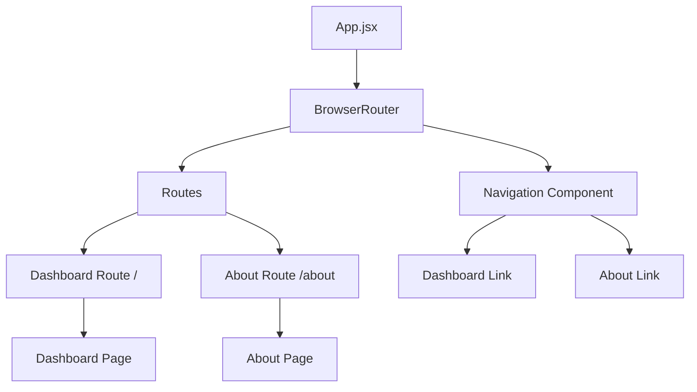

# Design Document: About Page

## Overview

This design transforms the WaniKani Dashboard from a single-page application into a multi-page application by adding routing capabilities and an About page. The solution uses React Router DOM v6 for client-side routing, maintains the existing dashboard functionality, and adds a new informational About page with consistent navigation.

## Architecture

The application will adopt a standard React Router architecture with the following key components:

- **Router Provider**: Wraps the entire application to enable routing
- **Navigation Component**: Provides consistent navigation across all pages  
- **Page Components**: Dashboard (existing functionality) and About (new page)
- **Route Configuration**: Defines URL paths and their corresponding components



## Components and Interfaces

### Router Setup
- **BrowserRouter**: Provides HTML5 history API routing
- **Routes**: Container for route definitions
- **Route**: Individual route mapping URL to component

### Navigation Component
```javascript
interface NavigationProps {
  // No props needed - self-contained component
}

// Navigation items configuration
const navigationItems = [
  { path: '/', label: 'Dashboard', icon: 'BarChart3' },
  { path: '/about', label: 'About', icon: 'Info' }
];
```

### Page Components
```javascript
// Dashboard Page (refactored from existing App.jsx content)
interface DashboardPageProps {
  // No props needed - self-contained page
}

// About Page (new component)
interface AboutPageProps {
  // No props needed - static content page
}
```

### Route Configuration
```javascript
const routes = [
  {
    path: '/',
    element: <DashboardPage />,
    index: true
  },
  {
    path: '/about',
    element: <AboutPage />
  }
];
```

## Data Models

No new data models are required for this feature. The existing data structures for WaniKani dashboard data remain unchanged.

## Correctness Properties

Let me analyze the acceptance criteria for testable properties using the prework tool.

*A property is a characteristic or behavior that should hold true across all valid executions of a system—essentially, a formal statement about what the system should do. Properties serve as the bridge between human-readable specifications and machine-verifiable correctness guarantees.*

Based on the prework analysis, I've identified several properties that can be tested programmatically, while some acceptance criteria are better suited for example-based testing or are not easily testable.

### Property Reflection

After reviewing all testable criteria from the prework, I've identified the following consolidation opportunities:
- Navigation properties (1.2, 1.3, 1.4, 1.5) can be grouped as they all test navigation behavior
- URL routing properties (3.4, 3.5) complement the navigation properties
- Responsive properties (4.1, 4.2, 4.4) can be consolidated as they test similar responsive behavior

### Testable Properties

**Property 1: Navigation link functionality**
*For any* navigation link in the application, clicking it should navigate to the correct page and update the URL accordingly
**Validates: Requirements 1.2, 1.3, 3.5**

**Property 2: Active page highlighting**
*For any* page navigation, the navigation system should highlight the currently active page and remove highlighting from inactive pages
**Validates: Requirements 1.4**

**Property 3: Navigation visibility consistency**
*For any* page in the application, the navigation system should be visible and functional
**Validates: Requirements 1.5**

**Property 4: Invalid URL handling**
*For any* invalid or non-existent URL path, the router should handle it gracefully by displaying an error page or redirecting appropriately
**Validates: Requirements 3.3**

**Property 5: Browser history integration**
*For any* sequence of navigation actions, using browser back/forward buttons should correctly display the appropriate page and URL
**Validates: Requirements 3.4**

**Property 6: Responsive navigation behavior**
*For any* viewport size, the navigation system should remain functional and appropriately styled
**Validates: Requirements 4.1, 4.3**

**Property 7: Responsive page layout**
*For any* viewport size, page content should remain readable and properly formatted
**Validates: Requirements 4.2, 4.4**

## Error Handling

### Navigation Errors
- **Invalid Routes**: Implement a catch-all route that redirects to the dashboard or displays a 404 page
- **Navigation Failures**: Provide fallback navigation if JavaScript routing fails

### Component Loading Errors
- **Component Mount Errors**: Use React Error Boundaries to catch and handle component rendering errors
- **Missing Dependencies**: Ensure graceful degradation if routing library fails to load

### Responsive Design Failures
- **CSS Loading Issues**: Provide fallback styles that maintain basic functionality
- **Viewport Detection**: Handle edge cases where viewport size detection fails

## Testing Strategy

### Dual Testing Approach
This feature requires both unit tests and property-based tests to ensure comprehensive coverage:

**Unit Tests** will verify:
- Specific examples like root URL routing to dashboard
- About page content presence and structure
- Mobile navigation interface behavior
- Specific error scenarios

**Property-Based Tests** will verify:
- Navigation behavior across all possible navigation sequences
- URL routing consistency for any valid navigation path
- Responsive behavior across different viewport dimensions
- Browser history integration with various navigation patterns

### Property-Based Testing Configuration
- **Library**: Use `@fast-check/jest` for property-based testing in the React/Jest environment
- **Iterations**: Minimum 100 iterations per property test
- **Test Tags**: Each property test will reference its design document property using the format:
  - **Feature: about-page, Property 1: Navigation link functionality**

### Testing Framework Integration
- **Unit Testing**: Jest with React Testing Library for component testing
- **Property Testing**: @fast-check/jest for universal property validation
- **Integration Testing**: Test complete user flows including routing and navigation
- **Responsive Testing**: Test component behavior across different viewport sizes

**Note**: This testing strategy aligns with the existing project's approach, which uses Go with gopter for property-based testing on the backend. The frontend will use the JavaScript equivalent (@fast-check/jest) to maintain consistency in testing philosophy while using appropriate tools for each technology stack.

The combination of unit and property tests ensures both specific functionality works correctly and universal behaviors hold across all possible inputs and states.